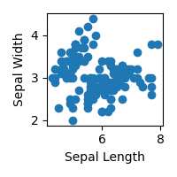
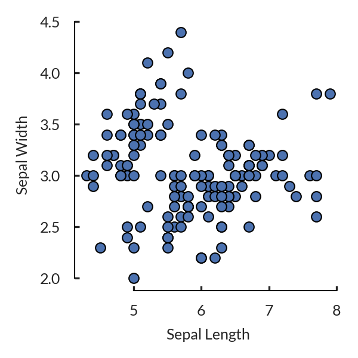

# scientific_plots
Implements matplotlib stylesheets that will create figures in the style of major academic journals.

This repo is heavily inspired by https://github.com/Timothysit/sciplotlib.

# Installation
```bash
pip install git+https://github.com/NilsWinter/scientific_plots.git
```

# Usage
This is the default matplotlib scatter plot.
```python
plt.figure(figsize=(2, 2))
plt.scatter(x, y)
plt.ylabel('Sepal Width')
plt.xlabel('Sepal Length')
plt.tight_layout()
plt.show()
```



And now with a custom matplotlib stylesheet.
```python
with plt.style.context(sp.get_style('mmll')):
    fig, ax = plt.subplots(figsize=(2, 2))
    plt.scatter(x, y)
    plt.ylabel('Sepal Width')
    plt.xlabel('Sepal Length')
    sp.polish(fig, ax)
    plt.show()
```


